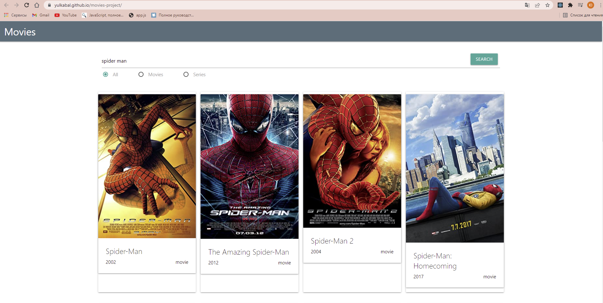

<h1 align="center">Movies project</h1>

## This project created with *React library*, *Materialize* and *omdbapi.com API*.
 
<h3><ul>Features:
<li>Find information about movie you like;</li>
<li>Filter search results by type, such as movies or series.</li>
</ul></h3>
<h2><a href="https://yulkabal.github.io/movies-project/">View a demo</a></h2>
 

